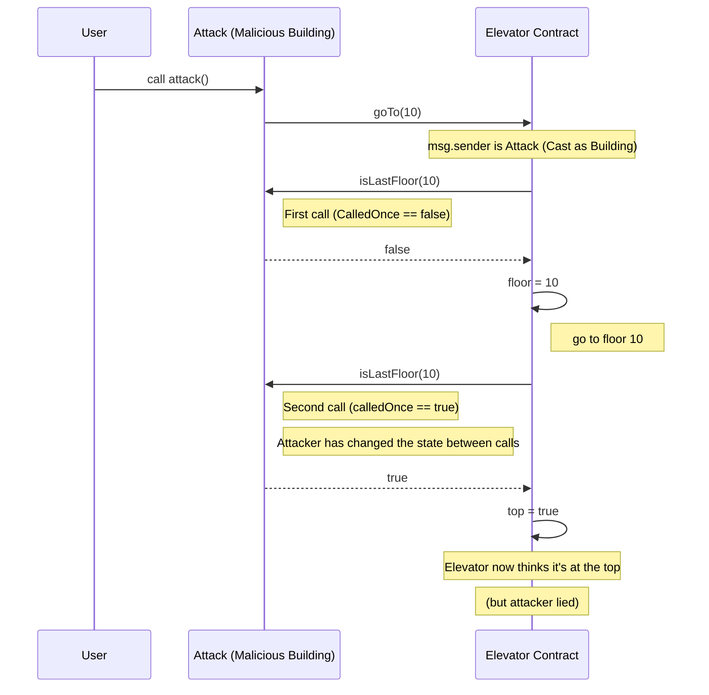

[<- Back](../../README.md)

# Security Review Report (Elevator)

## 📑 Table of Contents

- [Overview](#overview)
- [Summary](#vulnerability-summary)
- [Root Cause](#root-cause)
- [Attack Flow](#attack-flow)
  - [Outcome](#outcome)
- [Threat Modeling](#threat-modeling)
- [Recommended Fix](#recommended-fixes)
  - [Enforce `view` constraint](#1-enforce-view-semantics-minimal-fix)
  - [Avoid trusting `msg.sender` logic](#2-avoid-trusting-msgsender-logic-entirely)
  - [Defensive programming](#3-defensive-consistency-checks)
- [Conclusion](#conclusion)
- [References](#references)

---

## Overview

This report documents a logic manipulation vulnerability in the [`Elevator`](./src/Elevator.sol) smart contract challenge. The issue stems from improper trust in an external interface's return value, resulting in state corruption and unintended contract behavior.

While the contract is intentionally insecure (as part of a CTF), this pattern occurs in real-world systems and carries serious risks when mishandled.

## Vulnerability Summary

**Title**: Inconsistent External Call Logic (TOCTOU Flaw)
**Category**: Logic Bug / External Trust Violation
**Severity**: Medium
**Impact**: Arbitrary state manipulation
**Affected** Functionality: [Elevator.goTo(uint256 \_floor)](./src/Elevator.sol#L12)

## Root Cause

The `Elevator` contract naively assumes that repeated calls to an external interface (via `msg.sender`) will return **consistent**, **truthful** values.

Specifically, it calls `isLastFloor(_floor)` twice on `msg.sender`; expecting both calls to return the same result and reflect the true contract state. However, since `msg.sender` can be a malicious contract implementing the _Building_ interface, it can return different results across calls to manipulate the `Elevator`’s internal state.

This is a textbook **Time-of-Check to Time-of-Use (TOCTOU)** logic flaw.

## Attack Flow



### Exploit Execution

```bash
$ forge script ElevatorExploitDeployScript --account anvil --broadcast
$ forge script ElevatorExploitAttackScript --account anvil --broadcast
```

### Outcome

The `Elevator` contract sets `top = true` despite the `floor` being arbitrary. The attacker **bypasses intended logic checks** and _simulates reaching the top floor_ without constraint.

## Threat Modeling

### Trust Assumptions Violated

- Determinism Assumption: The contract assumes a `pure` function behavior without enforcing it.
- Caller Honesty: It implicitly trusts `msg.sender` to report truthful state.
- Consistency: It assumes no side-effects or changes between repeated _external_ calls.

These assumptions are broken when `msg.sender` is a malicious contract with mutable internal state.

## Risk in Production Environments

Although no Ether is transferred and the example is minimal, this design pattern is dangerous. In real-world systems, the same bug class can lead to:

- Access control bypass (e.g., falsely simulating role conditions)
- Logic branching on fabricated state (e.g., unlocking gated functions)
- Denial of service or bricked logic due to invalid state transitions
- Misleading UIs or dashboards built on corrupted contract state

## Recommended Fixes

### 1. Enforce `view` Semantics (Minimal Fix)

Update the `Building` interface to mark `isLastFloor()` as `view`:

```diff
interface Building {
function isLastFloor(uint256) external
+   view
    returns (bool);
}

```

While this **prevents internal state changes**, it does not prevent a malicious contract from returning different values using other tricks (e.g., pre-set state or toggling behavior externally). This is a **partial mitigation only**.

### 2. Avoid trusting `msg.sender` Logic Entirely

A robust fix avoids relying on external contracts for critical decisions. Instead, internalize logic:

```diff
// Assuming this contract knows the actual top floor (e.g. stored in state)
+ require(_floor <= topFloor , "Invalid floor");
+ floor = _floor;
+ top = (_floor == topFloor);
```

If dynamic verification is necessary, only consult **whitelisted**, trusted contracts or use **cryptographic proofs**.

### 3. Defensive Consistency Checks

If double-calling an external view function is necessary (e.g., due to limitations), at minimum add sanity checks:

```diff
+ bool first = building.isLastFloor(_floor);
+ bool second = building.isLastFloor(_floor);
+ require(first == second, "Inconsistent result");
```

This does not prevent all attacks but serves as a runtime alarm for basic manipulation attempts.

## Conclusion

Even "read-only" external calls can lie. Never assume consistency or honesty unless:

- The external contract is under your control
- You enforce `view`/`pure` modifiers
- Or you verify inputs cryptographically

This attack class underscores a core security principle in smart contract development:

> Trust boundaries must be explicit.
> Anything else is an exploit waiting to happen.

## References

- [Elevator CTF (Ethernaut)](https://ethernaut.openzeppelin.com/level/11)
- [Time-of-Check to Time-of-Use (TOCTOU)](https://cwe.mitre.org/data/definitions/367.html)
